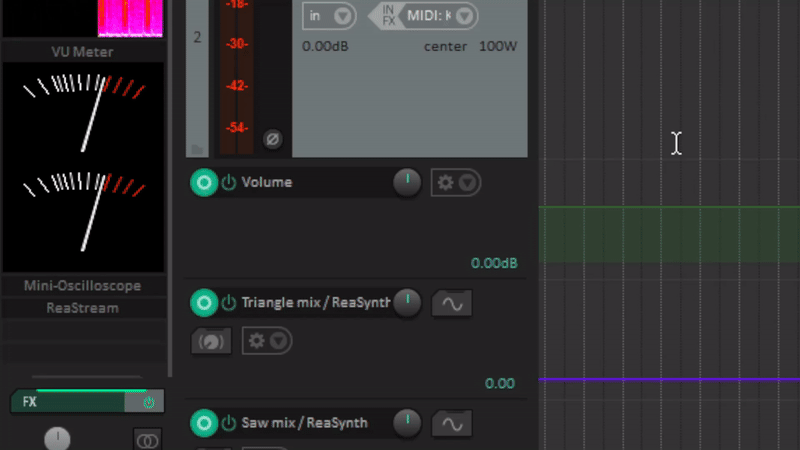

# Mini-Oscilloscope

Este script JSFX foi desenvolvido para a DAW REAPER e é baseado no repositório [Corrscope](https://github.com/corrscope/corrscope). O Mini-Oscilloscope oferece uma visualização interativa do áudio com várias opções de customização.
[This JSFX script was developed for the REAPER DAW and is based on the Corrscope repository. The Mini-Oscilloscope offers an interactive visualization of audio with various customization options.]

## Como Reage a Diferentes Tipos de Dimensões de Som

Projetado para reagir a várias dimensões de som, incluindo canais individuais (L e R) e uma combinação de ambos (L + R). Ele ajusta a visualização conforme o tipo de entrada de áudio para proporcionar uma representação precisa da forma de onda.

## Compatibilidade UI em MCP

A interface do Mini-Oscilloscope é totalmente compatível com o Mixer Control Panel (MCP) do REAPER. Ele se integra perfeitamente, permitindo fácil acesso e visualização diretamente no painel de mixagem, sem a necessidade de janelas separadas.

## Customizações de Cores, Amplitude e Opacidade

Customizações para melhorar a experiência de visualização. As cores do waveform e do grid, bem como a amplitude e a opacidade dos mesmos podem ser ajustados ao gosto.

---

### Instruções de Uso

1. **Instalação**: Copie o script `Mini-Oscilloscope.jsfx` para a pasta de scripts do REAPER.
2. **Carregamento**: Abra o REAPER, vá até o FX Browser, e carregue o `Mini-Oscilloscope`.
3. **Configuração**: Utilize os sliders para ajustar as dimensões do som, compatibilidade UI e customizações de cores, amplitude e opacidade conforme necessário.

### Contribuição

Contribuições são bem-vindas.

### Licença

Licenciado sob a [Licença MIT](LICENSE).

# ENGLISH VERSION
# Mini-Oscilloscope

This JSFX script was developed for the REAPER DAW and is based on the Corrscope repository. The Mini-Oscilloscope offers an interactive visualization of audio with various customization options.

## How It Reacts to Different Types of Sound Dimensions

The Mini-Oscilloscope is designed to react to various sound dimensions, including individual channels (L and R) and a combination of both (L + R). It adjusts the visualization according to the type of audio input to provide an accurate representation of the waveform.

## UI Compatibility in MCP

The Mini-Oscilloscope interface is fully compatible with the REAPER Mixer Control Panel (MCP). It integrates seamlessly, allowing easy access and visualization directly in the mixing panel without the need for separate windows.

## Customizations of Colors, Amplitude, and Opacity

The Mini-Oscilloscope allows various customizations to enhance the viewing experience. Users can adjust the colors of the waveform and grid, as well as their amplitude and opacity. These customizations help tailor the oscilloscope's appearance to personal preferences or specific project needs.

---

### Usage Instructions

1. **Installation**: Copy the `Mini-Oscilloscope.jsfx` script to the REAPER scripts folder.
2. **Loading**: Open REAPER, go to the FX Browser, and load the `Mini-Oscilloscope`.
3. **Configuration**: Use the sliders to adjust the sound dimensions, UI compatibility, and customizations of colors, amplitude, and opacity as needed.

### Contribution

Contributions are welcome! Please feel free to submit Pull Requests or open Issues on the GitHub repository.

### License

This project is licensed under the [MIT License](LICENSE).
